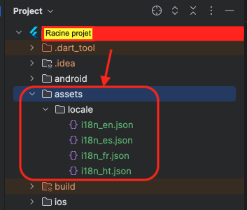

# brain_dev_tools

brain_dev_tools est un plugin tout-en-un conçu pour simplifier le développement Flutter en regroupant plusieurs utilitaires essentiels en un seul package. Il inclut des outils pour la gestion des dates, le stockage local, la manipulation de chaînes, les conversions de données et bien plus encore. Idéal pour les développeurs cherchant à optimiser leur code avec des fonctions réutilisables et performantes.

```yaml
  brain_dev_tools:
    git:
      url: https://github.com/Grafritz/brain_dev_tools_plugin.git
      ref: 'master'
```

## Getting started

TODO: List prerequisites and provide or point to information on how to
start using the package.

## Usage
Pour l'utiliser ajouter dans Main `googleAds.initBrainDevToolsDependencies();`

```dart

import 'package:brain_dev_tools/config/dependencies_tools.dart' as brainDev;

FutureOr<void> main() async {
  WidgetsFlutterBinding.ensureInitialized();

  // Setup important
  SetUpEnvironment.dev(appConfig: AppConfig(
    appName: '',
    urlWebServer: '',
    urlApiServer: '',
    appImage: ImageModel(
        logoCircleLight: '',
        logoSquareLight: '',
        logoSquareDark: '',
        bgImageLight: '',
        bgImageDark: ''
    ),
    enumEnvironmentType: EnumEnvironmentType.custom,
    templateLogin: EnumTemplateLogin.template1,
    endPointApi: EndPointApiModel(
        login: 'api/v1/login-register-provider',
        register: 'api/v1/register',
        forgetPassword: 'api/v1/',
        privacyPolicy: 'api/v1/',
        termsConditions: 'api/v1/'
    ),
    googleAds: GoogleAdsModel(
      appIdAdMobAndroid: 'ca-app-pub-5335107298173193~6136651602',
      appOpenAdMobAndroid: '',
      bannerAdMobAndroid: '',
      interstitielAdMobAndroid: '',
      rewardedAdMobAndroid: '',
      rewardedInterstitielAdMobAndroid: '',
      natifAdvancedAdMobAndroid: '',
      //iOS
      appIdAdMobIOS: 'ca-app-pub-5335107298173193~6136651602',
      appOpenAdMobIOS: '',
      bannerAdMobIOS: '',
      interstitielAdMobIOS: '',
      rewardedAdMobIOS: '',
      rewardedInterstitielAdMobIOS: '',
      natifAdvancedAdMobIOS: '',
    ),
    firebaseOptions: DefaultFirebaseOptions.currentPlatform,
    appLanguages: List<LanguageModel> [
      LanguageModel(
        imageUrl: '',
        languageName: '',
        countryCode: 'US',
        languageCode: 'en',
        emoji: '🇺🇸')
    ],
  ));
  
  brainDev.initBrainDevToolsDependencies();

  runApp(const MyApp());
}
```
et pour acceder aux variables
```dart
var appName = EnvironmentVariable.appName;
var appImage = EnvironmentVariable.appImage;
var appLanguages = EnvironmentVariable.appLanguages;
var urlWebServer = EnvironmentVariable.urlWebServer;
var urlApiServer = EnvironmentVariable.urlApiServer;
var environmentType = EnvironmentVariable.environmentType;
var templateLogin = EnvironmentVariable.templateLogin;
var endPointApi = EnvironmentVariable.endPointApi;
var googleAds = EnvironmentVariable.googleAds;
var firebaseOptions = EnvironmentVariable.firebaseOptions;
var appTranslator = EnvironmentVariable.appTranslator;
```
Pour les langues la variable
```dart 
appLanguages
``` 
doit avoir des valeurs pour avoir access a
```dart
AssetsLocaleL10n.appTranslator()
```
## Additional information
```dart
showLanguesChoice();
Get.find<ThemeController>().showColorThemeDialog();
```
## Internationalisation
A la racine de votre projet creer un ``repertoire assets/locale/i18n_[languageCode].json``

<br />Exemple:<br />

This project is a starting point for a Flutter
[plug-in package](https://flutter.dev/to/develop-plugins),
a specialized package that includes platform-specific implementation code for
Android and/or iOS.

For help getting started with Flutter development, view the
[online documentation](https://docs.flutter.dev), which offers tutorials,
samples, guidance on mobile development, and a full API reference.

